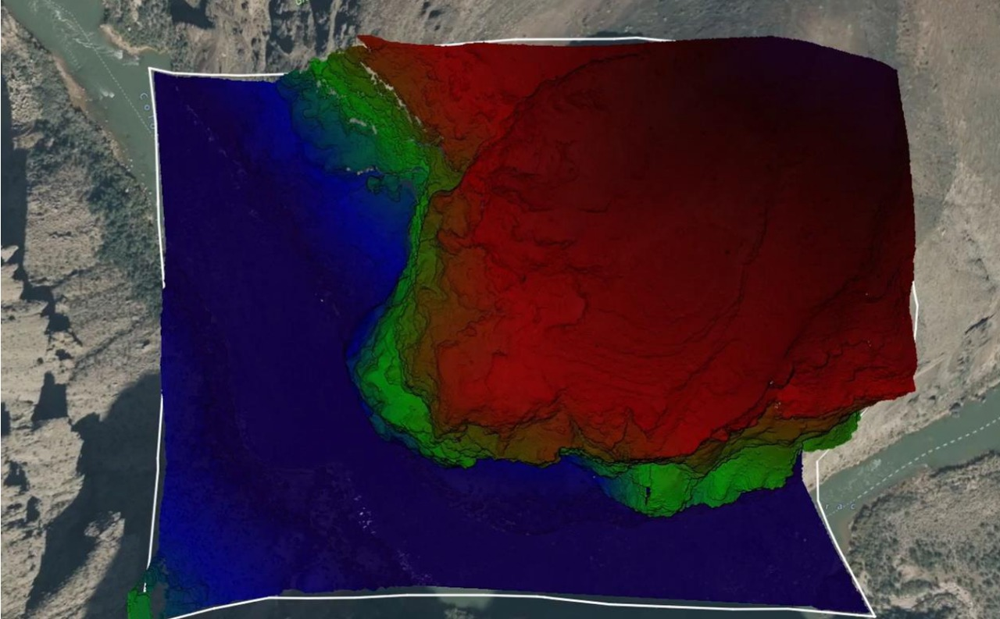
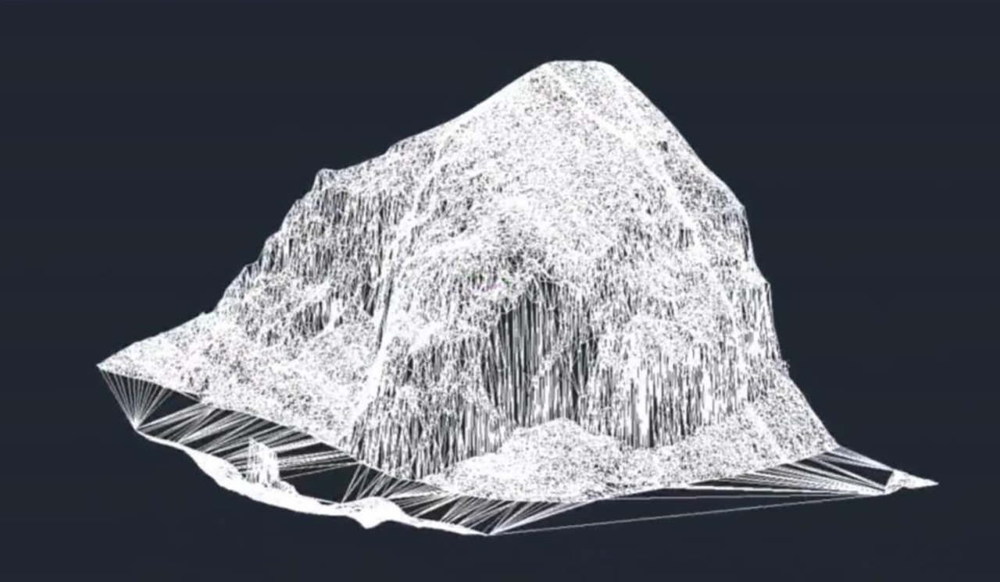
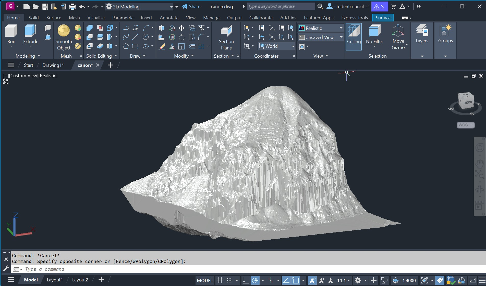
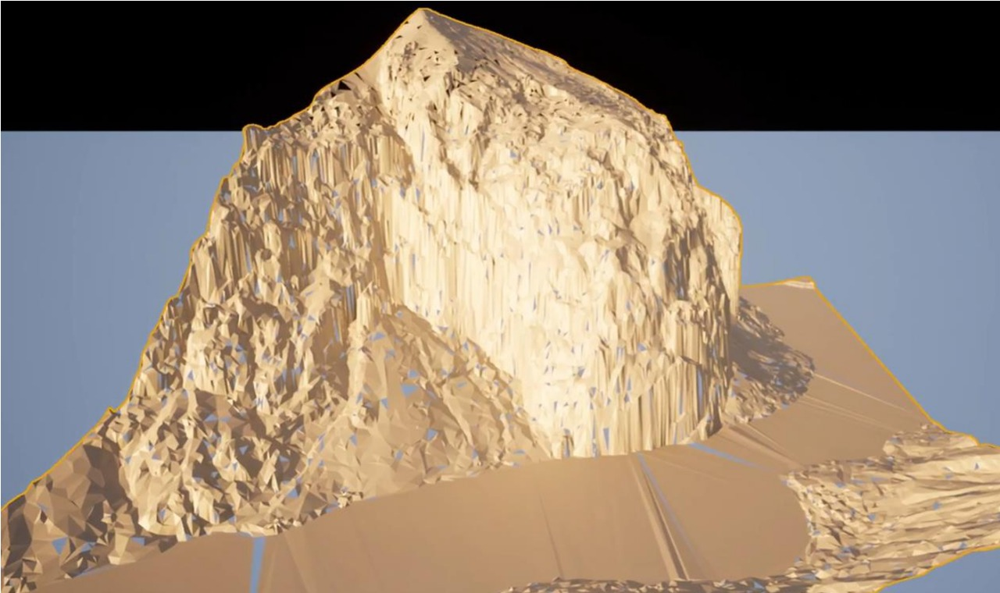
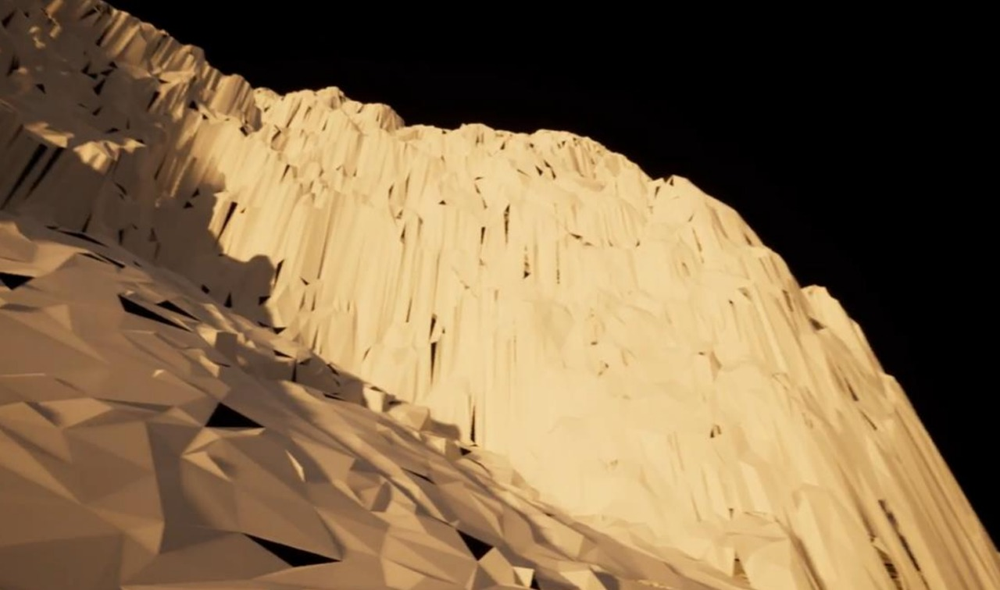

# Virtual Reality-Based Infrastructure Reconstruction

## 🏗️ Overview

This final year capstone project demonstrates the transformation of raw LiDAR data into immersive 3D environments for infrastructure simulation and urban planning. Using a combination of AutoCAD, Civil 3D, and Unreal Engine, the project showcases a virtual walkthrough of reconstructed city zones, offering potential applications in smart cities, public safety, and disaster recovery.

## 🔧 Technologies Used

- **LiDAR datasets** (for terrain and point cloud input)
- **AutoCAD & Civil 3D** (for precise 3D modeling and infrastructure design)
- **Unreal Engine** (for building an immersive VR experience)
- **Metaverse integration** (visualization within an explorable virtual space)

## 👤 My Role

- Processed and filtered raw LiDAR point clouds to extract usable terrain data.
- Modeled complex structures and layout plans in AutoCAD and Civil 3D.
- Integrated 3D models into Unreal Engine to create a VR-ready simulation.
- Handled all optimization steps for smooth walkthroughs and visual fidelity.
- Drafted a formal grant proposal and collaborated with faculty for internal review.

## 💡 Project Goal

To bridge the gap between raw geospatial data and intuitive infrastructure visualization by creating an immersive VR-based planning tool accessible to both technical and non-technical stakeholders.

## 📸 Visuals

| Stage | Preview |
|-------|---------|
| **LiDAR Point Cloud** |  |
| **Autodesk AutoCAD Model** |  |
| **Civil 3D Infrastructure** |  |
| **Unreal Engine VR Scene** |  |
| **Metaverse Viewport** |  |

## 🎥 Demo Video

Watch the walkthrough demo here:  
📽️ [Virtual Reality Infrastructure Demo (Google Drive)](https://drive.google.com/file/d/10I5sRXHChkhUu8g30cOfogv-dfdUsG7A/view?usp=sharing)

## 📝 Grant Proposal

This project was partially funded through a departmental grant proposal. The proposal is not attached publicly as it contains sensitive academic and technical details submitted for internal review.

## 🧠 Key Learnings

- Integrated knowledge across civil engineering, geospatial data, and interactive tech.
- Balanced high-fidelity modeling with performance optimization for real-time VR.
- Understood the real-world challenges of converting spatial data into accessible visuals.

## ✍️ Author

[Akanksha Yadav](https://github.com/ay03)  
B.Sc. IT Graduate | Data Enthusiast | XR Explorer  
